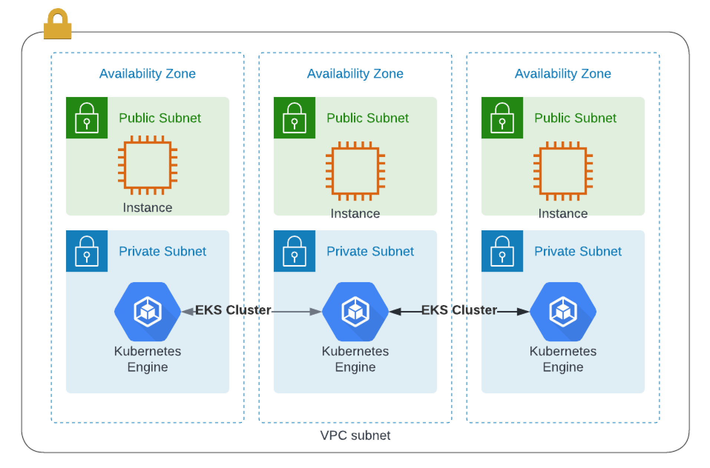

# consul-aws-eks-terraform

This simple guide will give you the ability to spin up a AWS Kubernetes Cluster with a basion server and consul.

## Prerequisites
The tutorial assumes some basic familiarity with Kubernetes and kubectl but does not assume any pre-existing deployment.

It also assumes that you are familiar with the usual Terraform plan/apply workflow. If you're new to Terraform itself, refer first to the Getting Started tutorial.

For this, you will need:

* an AWS account with the IAM permissions listed on the EKS module documentation,
* configured AWS CLI
* AWS IAM Authenticator
* kubectl installed
* install helm

### Mac Installer 

Use the package manager homebrew to install the AWS CLI.

```
brew install awscli
```

After you've installed the AWS CLI, configure it by running aws configure.

When prompted, enter your AWS Access Key ID, Secret Access Key, region and output format.

```
aws configure
AWS Access Key ID [None]: YOUR_AWS_ACCESS_KEY_ID
AWS Secret Access Key [None]: YOUR_AWS_SECRET_ACCESS_KEY
Default region name [None]: us-east-2
Default output format [None]: json
```

Your default region can be found in the AWS Web Management Console beside your username. Select the region drop down to find the region name (eg. us-east-1) corresponding with your location.

## Set up and initialize your Terraform workspace

In your terminal, clone the following repository. It contains the example configuration used in this tutorial.

```
git clone https://github.com/maniak-academy/consul-aws-eks-terraform
```

You can explore this repository by changing directories or navigating in your UI.

```
cd consul-aws-eks-terraform
```

In here, you will find six files used to provision a VPC, security groups, bastion server and an EKS cluster. The final product should be similar to this:



## Initialize Terraform workspace

Once you have cloned the repository, initialize your Terraform workspace, which will download and configure the providers.

``` terraform init```

## Provision the EKS cluster

In your initialized directory, run terraform apply and review the planned actions. Your terminal output should indicate the plan is running and what resources will be created.

``` terraform apply -auto-approve```

This terraform apply will provision a total of all resources (VPC, Security Groups, AutoScaling Groups, Bastion servers EKS Cluster, etc...).

This process should takes up to 10 minutes. Upon successful application, your terminal prints the outputs defined in outputs.tf.

## Configure kubectl
Nex you will need to configure kubectl.

Run the following command to retrieve the access credentials for your cluster and automatically configure kubectl.

```aws eks --region $(terraform output -raw region) update-kubeconfig --name $(terraform output -raw cluster_name)```

You can then run the command kubectl cluster-info to verify you are connected to your Kubernetes cluster:

```
$ kubectl cluster-info
Kubernetes control plane is running at https://CCDC5A7DBF4D10997D02A063A1C1CD70.gr7.us-east-2.eks.amazonaws.com
CoreDNS is running at https://CCDC5A7DBF4D10997D02A063A1C1CD70.gr7.us-east-2.eks.amazonaws.com/api/v1/namespaces/kube-system/services/kube-dns:dns/proxy
```


## Deploy Consul on Amazon Elastic Kubernetes Service (EKS)
You can deploy a complete Consul datacenter using the official Consul Helm chart or the Consul K8S CLI. By default, these methods will install a total of three Consul servers as well as one client per Kubernetes node into your EKS cluster. You can review the Consul Kubernetes installation documentation to learn more about these installation options.

### Create a values file
To customizer your deployment, you can pass yaml files to be used during the deployment; it will override the helm chart's default values. Take a look at the file provided in the repo <i>helm-consul-values.yaml </i> . 

Note: 
* If you want to access deploy consul on the internal load balancers in aws you will need to do add the following annotation 

```    annotations: |
      'service.beta.kubernetes.io/aws-load-balancer-internal': "true"
```


Here is the example Helm Chart. 

```
global:
  name: consul
  datacenter: maniak-dc1
ui:
  enabled: true
  service:
    type: LoadBalancer
connectInject:
  enabled: true
  default: true
controller:
  enabled: true
ingressGateways:
  enabled: true
  gateways:
    - name: ingress-gateway
      service:
        type: LoadBalancer
terminatingGateways:
  enabled: true
```

### Install Consul in your cluster
You can now deploy a complete Consul datacenter in your Kubernetes cluster using the official Consul Helm chart. 

```
helm repo add hashicorp https://helm.releases.hashicorp.com
```

Next you can install consul in using the helm chart.

```
helm install --values helm-consul-values.yaml consul hashicorp/consul --create-namespace --namespace consul --version "0.43.0"
```

Note: It will take a couple minutes for everthing to spin up.. about 3-5 minutes

Once it has been completed you can run the command <i> kubectl get pods --namespace consul </i> to verify three servers and three clients were successfully created.

```
$ kubectl get pods --namespace consul
NAME                                           READY   STATUS    RESTARTS   AGE
consul-client-9nrzh                            1/1     Running   0          2m30s
consul-client-g8sgr                            1/1     Running   0          2m30s
consul-client-kvx6h                            1/1     Running   0          2m30s
consul-connect-injector-c47b8bc4f-8pf8m        1/1     Running   0          2m30s
consul-connect-injector-c47b8bc4f-8t4pp        1/1     Running   0          2m30s
consul-controller-5bc8cf7fc9-8hrh2             1/1     Running   0          2m30s
consul-ingress-gateway-6f6c96bd8d-2mts7        2/2     Running   0          2m30s
consul-ingress-gateway-6f6c96bd8d-b6sv5        1/2     Running   0          2m30s
consul-server-0                                1/1     Running   0          2m30s
consul-server-1                                1/1     Running   0          2m30s
consul-server-2                                1/1     Running   0          2m30s
consul-webhook-cert-manager-859c76cdf6-rxlm9   1/1     Running   0          2m30s
```

## Accessing the Consul UI
Since you enabled the Consul UI in your values file, you can run the command <i>kubectl get services --namespace consul</i> to find the load balancer DNS name or external IP of your UI service.

You will notice that in my helm chart we are using internal load balancer so only internal services will be able to access the gui/cli. 

```
$ kubectl get services --namespace consul
NAME                        TYPE           CLUSTER-IP       EXTERNAL-IP                                                                        PORT(S)                                                                   AGE
consul-connect-injector     ClusterIP      172.20.29.57     <none>                                                                             443/TCP                                                                   14s
consul-controller-webhook   ClusterIP      172.20.56.81     <none>                                                                             443/TCP                                                                   14s
consul-dns                  ClusterIP      172.20.67.84     <none>                                                                             53/TCP,53/UDP                                                             14s
consul-ingress-gateway      LoadBalancer   172.20.219.122   internal-af42aea76dc6943cfa5f882fb9f19cf8-957087530.us-east-2.elb.amazonaws.com    8080:31015/TCP,8443:30352/TCP                                             14s
consul-server               ClusterIP      None             <none>                                                                             8500/TCP,8301/TCP,8301/UDP,8302/TCP,8302/UDP,8300/TCP,8600/TCP,8600/UDP   14s
consul-ui                   LoadBalancer   172.20.207.209   internal-a2f87cb6ff904447d82f31e8ef1832b0-1886756397.us-east-2.elb.amazonaws.com   80:30794/TCP   
```


## To uninstall Helm consul
To uninstall consul with helm you can run the following command 
```
helm uninstall consul --namespace consul
```


## Clean up your workspace
Remember to destroy any resources you create once you are done with this tutorial. Run the destroy command and confirm with yes in your terminal.

```terraform destroy```